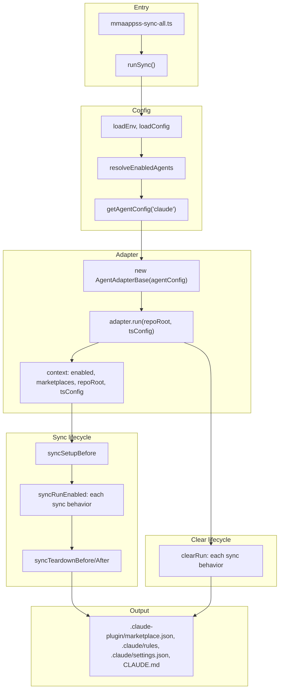

# mmaappss plugin

Driver plugin for the mmaappss sync system: discovers root and nested `.agents/plugins/`, writes marketplace manifests for Claude and Codex, syncs plugin content into `.cursor/` (rules, commands, skills, agents) for Cursor, and symlinks plugin rules into `.claude/rules/`.

---

## Purpose

This plugin has two roles:

1. **Driver** — Sync system for mmaappss: discovers `.agents/plugins/`, writes marketplace manifests (Claude, Codex), syncs plugin content into `.cursor/` for Cursor (rules as .mdc, commands/skills/agents symlinked), symlinks plugin rules into `.claude/rules/`, and symlinks CLAUDE.md from AGENTS.md.
2. **Reference example** — The canonical template for all future local `.agents/plugins`. When creating or updating any plugin under `.agents/plugins/<name>/`, base layout, conventions, and rules on this plugin. One source of truth for agent-agnostic plugin structure.

---

## Agent agnostic conventions and exceptions

We follow these conventions to support multiple coding agents from a single plugin:

| Convention | What we do | Why |
|------------|------------|-----|
| **Shared content** | One source of truth: `skills/`, `agents/`, `commands/`, `hooks/`, `rules/`, `.mcp.json` at plugin root. Both Cursor and Claude discover them. | Avoid duplication; "define once, use everywhere." |
| **Thin manifests** | Each plugin has `.cursor-plugin/plugin.json` and `.claude-plugin/plugin.json` with minimal metadata. No custom path overrides unless needed. | Each agent looks for its own manifest dir; both point at the same content. |
| **Include everything** | Add platform-specific components (e.g. `.lsp.json`, `settings.json` for Claude; `rules/` for Cursor) as needed. Each agent ignores what it doesn't understand. | No sync logic to strip or rewrite; minimal opinionated configuration. |
| **Rules** | Plugin `rules/` is **not** natively loaded by either platform. mmaappss symlinks into `.claude/rules/<plugin-name>/`. For Cursor, sync **copies** rules as `.mdc` with `alwaysApply: true` into `.cursor/rules/<plugin-name>/` (Cursor requires .mdc and frontmatter). | Rules are part of our schema; sync handles distribution. |

**Exceptions:**

- **Path override semantics** — Cursor: custom path **replaces** default discovery; Claude: custom path **supplements** defaults. Prefer default folders; document if you use custom paths.
- **Hooks** — Same `hooks/hooks.json` format; different event names (camelCase vs PascalCase). Each agent ignores unknown events. Split into platform-specific files only if unknown events cause errors.
- **scripts/** — Cursor uses `scripts/` for hook callables; mmaappss uses it for sync workers (plugin-internal tooling). See [scripts/ directory](#scripts-directory) below.

---

## What this plugin does

The mmaappss plugin is the **driver** of the local marketplace system:

- **Sync workers** in `scripts/` read config (env + TypeScript), discover root and nested `.agents/plugins/`, and idempotently:
  - Write `.claude-plugin/marketplace.json` (Claude) and symlink rules to `.claude/rules/<plugin-name>/`.
  - For **Cursor**: sync plugin content into `.cursor/` (no local marketplace — Cursor does not support it). Rules: copy as `.mdc` with `alwaysApply: true` to `.cursor/rules/<plugin-name>/`. Commands, skills, agents: symlink into `.cursor/commands/`, `.cursor/skills/`, `.cursor/agents/`. See [docs/CURSOR-VS-CLAUDE-PLUGINS.md](../../../../docs/CURSOR-VS-CLAUDE-PLUGINS.md) (Cursor: local marketplaces not supported).
  - Write `## packages (generated by mmaappss)` section in root **`AGENTS.override.md`** (Codex; see [Codex sync target](#codex-sync-target-agentsoverridemd) below).
- **Rules** — Claude: symlink into `.claude/rules/<plugin-name>/`. Cursor: copy as .mdc with frontmatter into `.cursor/rules/<plugin-name>/`.
- **CLAUDE.md symlinking** — When Claude is enabled, sync creates `CLAUDE.md` → `AGENTS.md` in every directory that has `AGENTS.md` (root and nested), so Claude sees the same instructions as Cursor/Codex. See [Root and nested context](#root-and-nested-context).
- **Context, rules, and skills** — This plugin also ships rules and skills that describe how to run, enforce, and audit the mmaappss system (meta documentation).

---

## Sync and clear flow

From a sync entrypoint (e.g. `mmaappss-sync-all.ts`) to output:



- **Sync:** Config is loaded, enabled agents resolved, then for each requested agent an `AgentAdapterBase` is created and `adapter.run()` runs the sync lifecycle (setup → syncRunEnabled for each behavior → teardown). Sync behaviors (e.g. rulesSymlink, localMarketplaceSync) receive context and write artifacts.
- **Clear:** Same config resolution; `adapter.clear()` runs the clear lifecycle (clearRun for each behavior). Behaviors remove or strip the same artifacts.

---

## Integration tests

Integration tests live under **scripts/integration-test/** and are **not part of vitest**. They back up agent dirs, run sync or clear, and assert filesystem outcomes. See [scripts/integration-test/README.md](../../scripts/integration-test/README.md) for how they work, default steps, and the data-flow diagram.

---

## Plugin layout spec

Canonical structure for an agent-agnostic plugin under `.agents/plugins/<plugin-name>/`:

```
<plugin-name>/
├── .cursor-plugin/
│   └── plugin.json          # Thin manifest for Cursor
├── .claude-plugin/
│   └── plugin.json          # Thin manifest for Claude
├── skills/                  # Shared: skills/<name>/SKILL.md
├── agents/                  # Shared: .md with frontmatter
├── commands/                # Shared: .md files (both platforms discover)
├── hooks/
│   └── hooks.json           # Shared (event names may differ per platform)
├── rules/                   # .md only (agent-agnostic); symlinked to .claude/rules, .cursor/rules. See rules/mmaappss-rules-purpose-and-guidelines.md
├── .mcp.json                # Shared
├── .lsp.json                # Claude-only (Cursor ignores)
├── settings.json            # Claude-only (e.g. default agent)
├── scripts/                 # Hook callables and/or plugin-internal tooling
├── assets/                  # Logos (Cursor); optional
└── README.md
```

**Guidance:**

- Use **default locations** for shared content. Avoid manifest path overrides unless you have a concrete need; path behavior differs between Cursor (replace) and Claude (supplement).
- Add platform-specific files (`.lsp.json`, `settings.json`, `outputStyles`) when targeting that platform. Other agents ignore them.

---

## Platform differences (portability)

| Component | Cursor | Claude | Notes |
|-----------|--------|--------|-------|
| Manifest | `.cursor-plugin/plugin.json` (required) | `.claude-plugin/plugin.json` (optional) | Different dirs |
| Rules | `rules/` → copied as .mdc with `alwaysApply: true` | — | mmaappss: symlink for Claude; copy+transform for Cursor |
| Skills | `skills/<name>/SKILL.md` | `skills/` or `commands/` + `SKILL.md` | Same standard |
| Commands | `commands/` (separate) | `commands/` (legacy skills) | Same dir works for both |
| Hooks | `hooks/hooks.json` | Same | Different event names |
| LSP | — | `.lsp.json` / `lspServers` | Claude-only |
| Settings | — | `settings.json` | Claude-only |

Full comparison: [CURSOR-VS-CLAUDE-PLUGINS.md](../../../../docs/CURSOR-VS-CLAUDE-PLUGINS.md) in the repo `docs/` folder.

---

## Codex sync target: AGENTS.override.md

We write the generated **packages** section to **`AGENTS.override.md`** at the repo root, not to `AGENTS.md`. Codex (and only Codex) supports [AGENTS.override.md](https://developers.openai.com/codex/guides/agents-md/): in each directory it checks `AGENTS.override.md` first, then `AGENTS.md`. Using the override file keeps your hand-edited `AGENTS.md` untouched and gives Codex the plugin list as override instructions. If you previously had the section in `AGENTS.md`, you can remove that section manually; sync will only read/write `AGENTS.override.md`.

---

## Extension points

Platform-only components are safe to include; each agent uses what it understands:

- **LSP** — `.lsp.json` or `lspServers` in manifest. Claude-only. Cursor ignores.
- **Plugin settings** — `settings.json` with e.g. `agent` (default agent). Claude-only.
- **Output styles** — `outputStyles` in manifest. Claude-only.
- **Rules** — `rules/` in our schema. Claude: mmaappss symlinks. Cursor: mmaappss copies as .mdc with frontmatter (Cursor does not support local marketplace).

---

## scripts/ directory

The `scripts/` folder serves two distinct uses:

1. **Hook callables** (Cursor/Claude convention) — Shell scripts or utilities invoked by `hooks/hooks.json` at runtime (e.g. `format-code.py`).
2. **Plugin-internal tooling** (mmaappss) — Sync workers, CLIs, build steps that run outside the agent session (e.g. `mmaappss-sync-all.ts`).

Both can live under `scripts/`. Optionally subdivide: `scripts/hooks/` for callables, `scripts/sync/` or `_tooling/` for plugin engine code. mmaappss keeps sync entrypoints at `scripts/` root; document the distinction in your plugin README.

---

## Configuration

### Environment variables

- `MMAAPPSS_MARKETPLACE_ALL` — Master switch for all local marketplaces.
- `MMAAPPSS_MARKETPLACE_CLAUDE`, `MMAAPPSS_MARKETPLACE_CURSOR`, `MMAAPPSS_MARKETPLACE_CODEX` — Per-agent marketplace enable/disable.

Committed defaults: `.env`. Overrides: `.envrc.local` (gitignored). Process env takes precedence over file values.

### Local marketplace name

The name written to `.claude-plugin/marketplace.json` and Claude `settings.json` (e.g. `extraKnownMarketplaces`, `enabledPlugins`) defaults to **`mmaappss-sync`** (matches the package name). Preset options can override it per agent.

### TypeScript config

`mmaappss.config.ts` at **repo root** provides the same enable/disable semantics as env vars. Use env, TS config, or both; env overrides TS config. Scripts run via `tsx` (e.g. `pnpm run mmaappss:sync` runs `scripts/mmaappss-sync-all.ts`).

### Exclusions

- **Supported:** Exclude entire root or nested **directories** from `.agents/plugins/` discovery (e.g. `node_modules/`, `dist/`).
- **Future:** Exclude specific plugins or files; config shape allows adding without breaking changes.

### Logging

- **`loggingEnabled`** (TS config) / **`MMAAPPSS_LOGGING_ENABLED`** (env) — When true, structured logs (Pino) are written to `.mmaappss/logs/mmaappss.log` at repo root. Off by default. See the **pino-logger** plugin (`.agents/plugins/pino-logger/`) for strategy, how to enable, and how to use logs for debugging.

### Post-merge sync (git hook)

- **`postMergeSyncEnabled`** (TS config) / **`MMAAPPSS_POST_MERGE_SYNC_ENABLED`** (env) — When true, the **post-merge** script runs marketplace sync (all agents) when invoked, e.g. from `.githooks/post-merge` after `git pull` or merge. Off by default. Use a git hook that calls the script (e.g. `pnpm --filter @mmaappss/sync run mmaappss:post-merge` from monorepo root, or from a consumer repo run the package’s `mmaappss:post-merge` script). Enable hooks with `git config core.hooksPath .githooks` (repo-local) or symlink `.githooks/post-merge` into `.git/hooks/post-merge`.

---

## Root and nested context

For "root context" (e.g. `AGENTS.md` at repo root) and "nested context" (e.g. `packages/pkg/AGENTS.md`): Cursor and Codex use `AGENTS.md` natively. Claude uses `CLAUDE.md`. When the Claude marketplace is enabled, mmaappss sync creates a `CLAUDE.md` symlink pointing to `AGENTS.md` in every directory that has `AGENTS.md` (respecting `excluded`). Sync also ensures `CLAUDE.md` is listed in root `.gitignore` so symlinked files are not committed; only `AGENTS.md` is committed.

---

## Sync scripts

| Script | Purpose |
|--------|---------|
| `mmaappss-sync-all.ts` | Sync all enabled agents (preset + custom from config) and clear disabled ones; uses union of preset agents, config-enabled agents, and manifest keys. |
| `mmaappss-sync-clear-all.ts` | Clear all agents in the same union set (preset + config-enabled + manifest). |

Run via package script: `pnpm run mmaappss:sync` or `pnpm run mmaappss:sync:clear`. See [packages/sync/README.md](../../README.md) for package-level overview.
