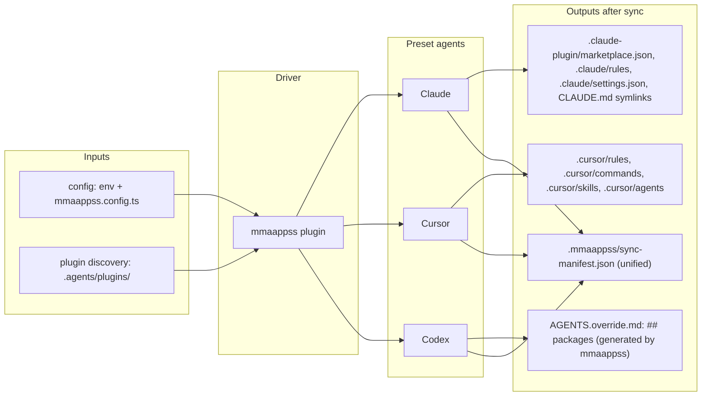

# mmaappss

**Beta.** This package is in beta. API and behavior may change; we recommend pinning the version (e.g. `0.1.0-beta.1`).

**pronounced:** `maps`

**stands for:**
> mutant marketplaces and agent portable plugins super sync
> or 
> mega marketplaces and adaptive pretend plugins sync system
> or
> magic marketplaces and aggressively pungent plugins sync sauce 
> ...idk, don't really care 😆

## purpose

- support local marketplaces and plugins!
- unify the fragmented state of sharing rules, commands, skills, agents, etc
- define once, empower developers on teams to use with their preferred coding agent(s)
- prioritze minimal configurations to get start, but powerful options for when you need them
- keep it simple dumb-ass (kisda) & don't reinvent the wheel
- provide a way to group releated rules, commands, skills, agents, etc. together
- leverage available APIs and -- as of the moment I'm typing this -- that's marketplaces and plugins!

## system overview

## different ways to sync

our goal is to support **four ways** of syncing contexts/rules/commands/skills/agents/etc

1. **root marketplace** — root-level local marketplace manifest and plugins
2. **nested marketplaces** — nested directories local marketplaces and plugins
3. **root context** — instructions that apply everywhere (e.g. `AGENTS.md` / `CLAUDE.md` in user home or app config)
4. **nested context** — instructions per repo or per directory (e.g. `AGENTS.md` / `CLAUDE.md` in project and subdirs)

Focus here is **local marketplaces** (repo-as-marketplace), not public Cursor Marketplace or team marketplaces.

<table>
  <thead>
    <tr>
      <th></th>
      <th>claude</th>
      <th>codex</th>
      <th>cursor</th>
    </tr>
  </thead>
  <tbody>
    <tr>
      <td><strong>root marketplace</strong></td>
      <!-- CLAUDE -->
      <td>
        
✅ official support

        <ul>
          <li><code>.claude-plugin/marketplace.json</code></li>
          <li>script to sync</li>
          <li>symlink rules</li>
          <li>sync invalidates Claude's local plugin cache so source changes apply without bumping version</li>
        </ul>
        <a href="https://code.claude.com/docs/en/plugin-marketplaces">Create and distribute a plugin marketplace</a>
      </td>
      <!-- CODEX -->
      <td>
        
❓ no official support

        <ul>
          <li>no plugin marketplace</li>
          <li>workaround: we sync plugin list to <code>AGENTS.override.md</code> (Codex-only)</li>
        </ul>
        <a href="https://developers.openai.com/codex">Codex</a>, <a href="https://developers.openai.com/codex/mcp">MCP</a>
      </td>
      <!-- CURSOR -->
      <td>
        
<s>✅ official support</s> <strong>No local marketplace.</strong> As of this writing, Cursor does <em>not</em> support local marketplaces. Only <strong>public marketplace</strong> (cursor.com/marketplace) and <strong>team marketplace</strong> (GitHub repo URL in dashboard; Cursor fetches and parses the repo, including <code>marketplace.json</code>) are supported. We sync plugin content into <code>.cursor/</code> (rules, commands, skills, agents) instead.

        <ul>
          <li><code>.cursor/</code> content sync (rules as .mdc, commands/skills/agents symlinked)</li>
          <li>script to sync</li>
        </ul>
        <a href="https://cursor.com/docs/plugins/building">Building plugins</a>
      </td>
    </tr>
    <tr>
      <td><strong>nested marketplaces</strong></td>
      <!-- CLAUDE -->
      <td>
        
❓ no official support

        <ul>
          <li>script could do recursive search for these?</li>
          <li>...and also symlink rules?</li>
        </ul>
      </td>
      <!-- CODEX -->
      <td>❓ no official support</td>
      <!-- CURSOR -->
      <td>
        
❓ no official support

        <ul>
          <li>script could do recursive search for these?</li>
          <li>...and also symlink rules?</li>
        </ul>
      </td>
    </tr>
    <tr>
      <td><strong>root context</strong></td>
      <!-- CLAUDE -->
      <td>
        
✅ official support

        <ul>
          <li><code>~/CLAUDE.md</code></li>
          <li>symlink <code>AGENTS.md</code></li>
          <li>can also have `CLAUDE.local.md`</li>
        <a href="https://code.claude.com/docs/en/memory#claude-md-files">CLAUDE.md files</a>
        </ul>
      </td>
      <!-- CODEX -->
      <td>
        
✅ official support

        <ul>
          <li><code>~/AGENTS.md</code></li>
          <li>can also have `AGENTS.override.md`</li>
        </ul>
        <a href="https://developers.openai.com/codex/guides/agents-md/">Custom instructions with AGENTS.md</a>
      </td>
      <!-- CURSOR -->
      <td>
        
✅ official support

        <ul>
          <li><code>~/AGENTS.md</code></li>
          <li>✖︎ no known overrides</li>
        </ul>
        <a href="https://cursor.com/docs/context/rules#agentsmd">AGENTS.md support</a>
      </td>
    </tr>
    <tr>
      <td><strong>nested context</strong></td>
      <!-- CLAUDE -->
      <td>
        
✅ official support

        <ul>
          <li><code>~/CLAUDE.md</code></li>
          <li>symlink <code>AGENTS.md</code></li>
          <li>can also have `CLAUDE.local.md`</li>
        </ul>
      </td>
      <!-- CODEX -->
      <td>
        
✅ official support

        <ul>
          <li><code>~/AGENTS.md</code></li>
          <li>can also have `AGENTS.override.md`</li>
        </ul>
      </td>
      <!-- CURSOR -->
      <td>
        
✅ official 3rd-party support

        <ul>
          <li><code>~/AGENTS.md</code></li>
          <li>❓ unsure about `AGENTS.override.md`</li>
        </ul>
      </td>
    </tr>
  </tbody>
</table>

## Plugins

Plugins extend coding agents (Claude, Cursor, Codex) with rules, skills, agents, commands, hooks, MCP, etc. Our convention: **`.agents/plugins/`** is the single place for agent-agnostic, locally defined plugins. Each plugin has thin `.cursor-plugin/` and `.claude-plugin/` manifests that point at shared content — "define once, empower developers to use with their preferred coding agent(s)."

**How to build and organize plugins:** See the [mmaappss-sync plugin README](.agents/plugins/mmaappss-sync/README.md). It documents the canonical plugin layout, agent-agnostic conventions, platform differences, and configuration. Use it as a reference when creating plugins under `.agents/plugins/<your-plugin>/`.

Official docs: [Claude Plugins](https://code.claude.com/docs/en/plugins) · [Cursor Building plugins](https://cursor.com/docs/plugins/building) · [Codex](https://developers.openai.com/codex) (no plugin marketplace yet)

## The mmaappss plugin (driver)

The **mmaappss-sync** plugin lives at `.agents/plugins/mmaappss-sync/` (under this package). It is the sync engine: discovers root and nested plugins, writes marketplace manifests for Claude/Cursor/Codex, symlinks rules, and provides meta docs for running and auditing the system. Full details: [.agents/plugins/mmaappss-sync/README.md](.agents/plugins/mmaappss-sync/README.md).

## Configuration

- **Env vars:** `MMAAPPSS_MARKETPLACE_ALL`, `MMAAPPSS_MARKETPLACE_CLAUDE`, `MMAAPPSS_MARKETPLACE_CURSOR`, `MMAAPPSS_MARKETPLACE_CODEX`. Defaults in `.env`; overrides in `.envrc.local` (gitignored).
- **TypeScript config:** `mmaappss.config.ts` at repo root for same enable/disable semantics. Env overrides TS config.
- **Exclusions:** Directory exclusions supported; plugin/file exclusions planned.

See [plugin README](.agents/plugins/mmaappss-sync/README.md#configuration) for full configuration details.

## Root and nested context

Cursor and Codex can use `AGENTS.md` natively; Claude uses `CLAUDE.md`. We symlink `CLAUDE.md` from `AGENTS.md` (recursively) so Claude sees the same instructions. Symlinked `CLAUDE.md` files go in `.gitignore`. For Codex we write the generated plugin list to **`AGENTS.override.md`** so your `AGENTS.md` stays hand-editable. See [plugin README](.agents/plugins/mmaappss-sync/README.md#root-and-nested-context) and [Codex sync target](.agents/plugins/mmaappss-sync/README.md#codex-sync-target-agentsoverridemd).
