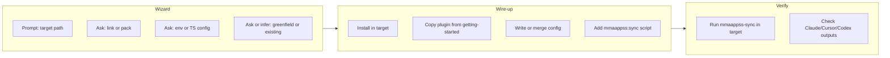

# Getting started with @mmaappss/sync

Bundle for first-time setup, local testing, and ongoing maintenance of `@mmaappss/sync` in consumer projects.

## Purpose

- **First-time setup** — Configure mmaappss sync in a new or existing project (local link/pack or npm install)
- **Play doctor** — Diagnose sync failures, version/schema mismatches, config issues
- **Updates** — Refresh sample plugins, templates in the target project
- **Remove** — Teardown mmaappss sync, configs, and artifacts (local or npm install)

## Plugin and skills

The **getting-started** plugin (`.agents/plugins/getting-started/`) provides five skills:

| Skill | Purpose |
|-------|---------|
| **setup-local-testing** | Initial setup for local testing: link or pack; wizard (path, link vs pack, env vs TS config, greenfield vs existing); wire-up; run sync; verify outputs |
| **setup-from-npm** | Initial setup after `pnpm add @mmaappss/sync`: wizard (config style, greenfield vs existing); wire-up; verify |
| **doctor** | Investigate failures, version/schema mismatches, config checks |
| **updates** | Refresh sample plugins and templates in target |
| **remove-mmaappss-sync** | Teardown wizard for both local and npm install targets |

## Skill flow (setup-local-testing / setup-from-npm)

## Templates

| File | Use |
|------|-----|
| **plugins/git/** | Sample plugin — copy to `<target>/.agents/plugins/git` for greenfield or to add the git plugin |
| **env.example** | Minimal MMAAPPSS_* env vars — copy to `<target>/.env` or merge into existing |
| **mmaappss.config.example.ts** | Consumer TypeScript config — copy to `<target>/mmaappss.config.ts`; imports from `@mmaappss/sync/config` |

## When to use each skill

- **setup-local-testing** — You're developing mmaappss and want to test in another repo via `pnpm link` or `npm pack`
- **setup-from-npm** — You've run `pnpm add @mmaappss/sync` and need config + sample plugin + script
- **doctor** — Sync fails, outputs are missing or outdated, or you need to debug config
- **updates** — New sample plugins or templates exist; refresh the target project
- **remove-mmaappss-sync** — Uninstall mmaappss sync and remove configs/artifacts
