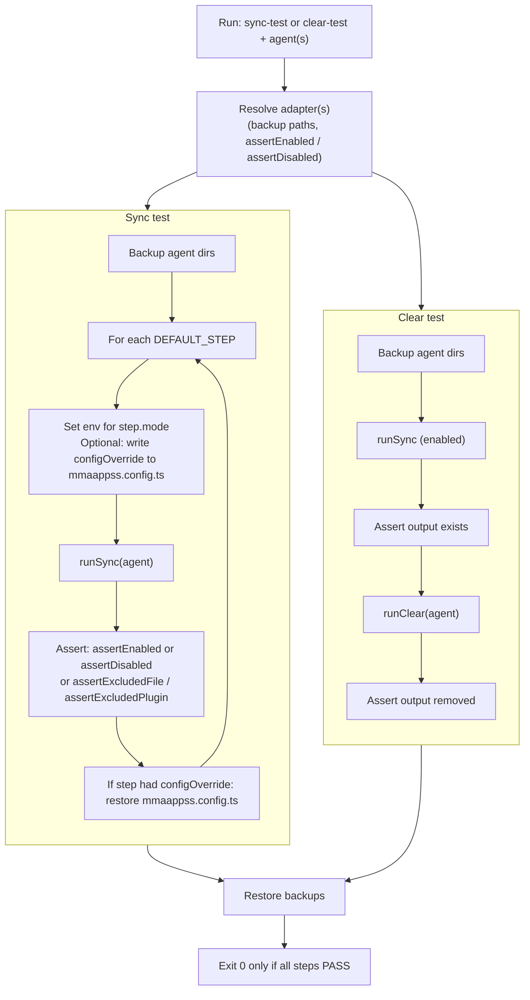

# Integration tests (old / deprecated)

**Deprecated.** This folder holds the previous adapter-based integration tests. Use the config-driven tests in **packages/sync-integration-tests** instead (`pnpm run test:integrations` from repo root).

---

Integration tests for marketplace sync and clear (Claude, Cursor, Codex). **Not part of vitest** — run via package scripts (e.g. `pnpm -F @mmaappss/sync run mmaappss:sync:test`).

## What they do

- **Sync test** (`mmaappss-sync-integration-test.ts`): Backs up agent-specific dirs, runs a sequence of steps (disabled → enabled → disabled → …) with `runSync([agent])`, and asserts expected filesystem state after each step. Restores backups when done.
- **Clear test** (`mmaappss-sync-clear-integration-test.ts`): For each agent, enables sync, asserts output exists, runs `runClear([agent])`, then asserts output is torn down.

## How to run

From repo root or package root:

- `pnpm -F @mmaappss/sync run mmaappss:sync:test` — all agents, sync integration test
- `pnpm -F @mmaappss/sync run mmaappss:sync:clear:test` — all agents, clear integration test
- `tsx scripts/integration-test/mmaappss-sync-integration-test.ts cursor enabled` — Cursor only, single condition (enabled)

## Data flow

You run a **sync test** or **clear test** for one agent (e.g. `cursor`) or `all`. The script resolves the **adapter** for each agent (Claude / Cursor / Codex). The adapter defines what to back up and how to assert enabled/disabled/excluded. The two tests use that adapter differently:

- **Sync test** loops over `DEFAULT_STEPS` (clean slate, create, remove, idempotent runs, excluded-path variants). Some steps set `configOverride` (e.g. `excluded: ['packages']`); the test backs up `mmaappss.config.ts`, writes the override, runs sync, asserts, then restores config. Assertions use the adapter’s `assertEnabled`, `assertDisabled`, or exclusion helpers.
- **Clear test** does not use steps: it runs sync once (enabled), asserts output exists, runs clear, asserts output is gone, then restores backups.
- **Adapter** (in `integration-test-adapters.ts`): implements `backupPaths`, `assertEnabled(root)`, `assertDisabled(root)`, and optionally `assertExcludedFileRemoved` / `assertExcludedPluginRemoved`. To add an agent or change what gets asserted, edit the adapter and (for sync) `DEFAULT_STEPS` or step `configOverride`s.
